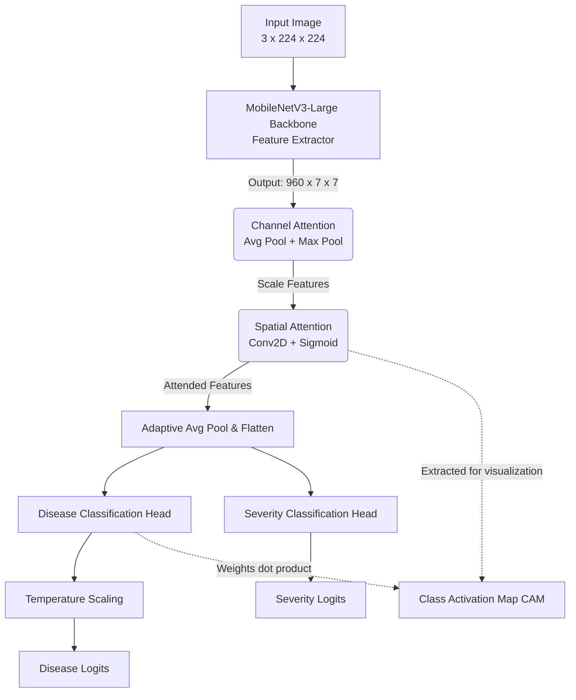

# AgriVision ML Pipeline

Welcome to the Machine Learning Pipeline for AgriVision. This directory contains the complete PyTorch training, model architecture, and export pipeline designed to run efficiently on edge devices (mobile phones) while maintaining high accuracy for crop disease detection.

---

## 🏗️ Model Architecture Flowchart

Below is the logical flow of data through the `AgriSenseModel` from raw image input to final disease and severity predictions.

---

## 🔍 Understanding the Layers

The `AgriSenseModel` is designed as a **Multi-Task Neural Network**. It predicts both the *type* of disease and its *severity* simultaneously. Here is a breakdown of what each layer does:

### 1. Backbone: MobileNetV3-Large
* **What it does**: Acts as the primary feature extractor. It takes the raw pixels of the leaf image and finds complex patterns (edges, shapes, textures, disease spots).
* **Why MobileNetV3?**: It uses depth-wise separable convolutions, making it incredibly lightweight and fast. This is essential for deploying the model directly onto Android/iOS devices without requiring cloud processing.

### 2. CBAM (Convolutional Block Attention Module)
The features from MobileNetV3 are passed into our custom CBAM module, which tells the network *what* and *where* to focus on.
* **Channel Attention**: Asks "What is meaningful in this image?" It applies both Average Pooling and Max Pooling across the channels to figure out which feature maps (e.g., color channels or texture maps) are most important. *(Note: Our implementation uses an ONNX-friendly max pooling mathematical equivalent to ensure mobile deployment works flawlessly).*
* **Spatial Attention**: Asks "Where is the disease located?" It looks across the spatial dimensions (the 7x7 grid) to highlight the physical locations of the spots or lesions on the leaf.

### 3. Adaptive Pooling & Flattening
* **What it does**: Takes the 3D attended feature map (960 channels x 7 width x 7 height) and squashes it into a flat 1D array of 960 numbers using `AdaptiveAvgPool2d(1)`.
* **Why**: Neural network classification heads (Linear layers) require flat vectors, not 2D images.

### 4. Multi-Task Heads
Instead of just classifying the disease, the network splits into two separate paths:
* **Disease Head**: A `Linear` layer that maps the 960 features to the number of disease classes (e.g., 11 classes for our Sugarcane dataset). 
* **Severity Head**: A `Linear` layer that maps the 960 features to severity levels (e.g., 3 levels: Low, Medium, High). 

### 5. Temperature Scaling
* **What it does**: We divide the disease logits by a learnable `temperature` parameter (initialized to 1.5). 
* **Why**: Deep learning models are often "overconfident" even when they are wrong. Temperature scaling softens the output probabilities, ensuring that the confidence percentages shown to the user in the app are accurately calibrated and trustworthy.

### 6. Edge CAM (Class Activation Mapping)
* **What it does**: The model explicitly returns the `attended_features` and exposes a `get_cam_weights()` method. 
* **Why**: By doing a mathematical dot product between the spatial features and the classification weights directly on the mobile device, the app can overlay a "heatmap" on the user's camera feed, showing them exactly which part of the leaf triggered the disease prediction!

---

## 🚀 Training Strategy

The pipeline includes scripts like `train_sugarcane.py` which optimize the model using:
* **Weighted Random Sampling**: Resolves severe class imbalances by oversampling rare diseases (like Pokkah Boeng).
* **RandAugment & Mixup**: Prevents overfitting by heavily augmenting the training images.
* **Label Smoothing & OneCycleLR**: Ensures generalized, stable, and fast convergence.
